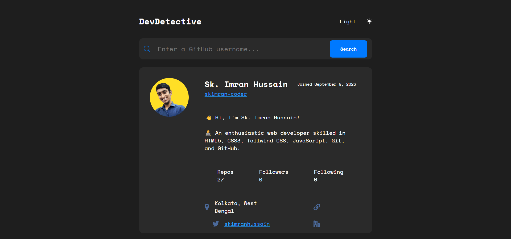

# Dev Detective

Dev Detective is a web application that allows you to search for GitHub user profiles and view their information. It provides a user-friendly interface to quickly access a user's GitHub details.



## Demo

You can try the live demo of this DevDetective [here](https://skimran-coder.github.io/Dev_Detective/).

## Features

- **GitHub User Search**: Enter a GitHub username in the search bar to view a user's profile.

- **Profile Information**: Displayed information includes the user's avatar, name, username, joining date, bio, repositories, followers, following, location, website, Twitter, and company.

- **Dark Mode**: Toggle between light and dark mode for better readability and user experience.

## Getting Started

These instructions will help you set up and run the project on your local machine.

### Prerequisites

- Web browser (Google Chrome, Mozilla Firefox, or any other modern browser).

### Installation

1. Clone the repository:

   ```bash
   git clone https://github.com/yourusername/dev-detective.git
   ```

2. Navigate to the project directory:

   ```bash
   cd dev-detective
   ```

3. Open the `index.html` file in your web browser:

   - Double-click the `index.html` file in your file explorer, or
   - Use your preferred method for opening HTML files in a web browser.

## Usage

1. Open the application in your web browser by following the installation steps.

2. Enter a GitHub username in the search bar and click the "Search" button to view the user's profile.

3. Toggle dark mode by clicking on the "Dark" text in the top-right corner.

4. Explore the user's GitHub information displayed on the page.

## Built With

- HTML
- CSS
- JavaScript

## Author

- [Sk. Imran Hussain](https://github.com/skimran-coder)

## Acknowledgments

- [GitHub API](https://developer.github.com/v3/): Used to fetch user data.
